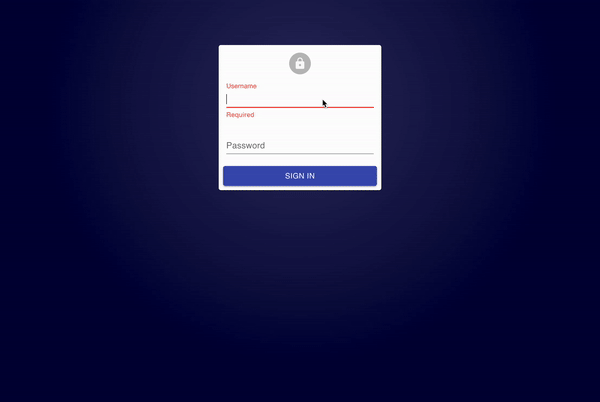

# RA MaterialUI Layout

I'm a big fan of [react-admin](https://github.com/marmelab/react-admin) and I've built a simple layout using [Material UI Mini drawer variant](https://v4.mui.com/components/drawers/) as you can see in this example:



## How to use

Basically you have to install the package:

```sh
npm i --save ra-ui-materialui-layout
```

And then you have to import and use it in you react-admin app:

```js
import { Layout } from "ra-ui-materialui-layout";
import { Admin, Resource } from "react-admin";
const App = () => (
  <Admin layout={Layout}>
    <Resource name="..." />
  </Admin>
);
```

## Configuration

The layout support the following configuration options:

- `drawerWidth`: the width of the drawer. Default is 240px.
- `appTitle`: the title of the app. Default is the name of the app.
- `appSubTitle`: the subtitle of the app. Default is the version of the app.
- `appVersion`: the version of the app. Default is the version of the app.

## TODO

- badge support
- custom menu support
- mobile support
- documentation

## How to contribute

Clone the repository and run `npm run i-all` to install dependencies.
After that, you can start to testing your app running `npm run dev`.
Use playground to test app with your own modifications.
